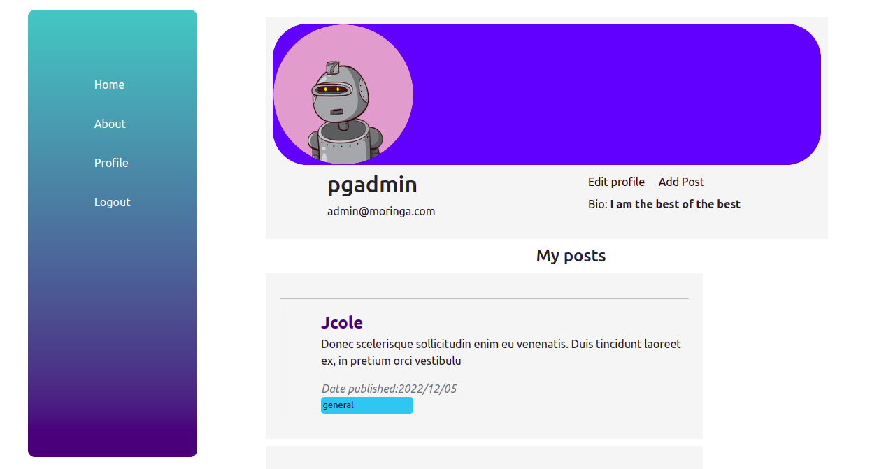

# One Time

This is a Flask Web app that enables users to signup for an account and sign in.
Users can post pitches, quotes, pick up lines and other things.

## Table of Contents

- [Technologies Used](#technologies-used)
- [Features](#features)
- [Screenshots](#screenshots)
- [Setup](#setup)
- [Usage](#usage)
- [Project Status](#project-status)
- [Updates](#updates)
- [Contact](#contact)

## Technologies Used

1. Flask
1. SQLAlchemy
1. Bootstrap
1. Python
1. PostgreSQL
1. Git
1. Heroku (for deployment)

## Features

- Signup
- Login
- Posting
- Commenting
- <strike>Voting</strike>
- Profile
- Logout

## Screenshots

### **Landing Page**

> 

### **Login**

> 

### **Profile**

> 

### **About & Contact**

> 

## **Setup**

Setting up the project is easy.

```sh
git clone https://github.com/Willbeckh/one-time.git
cd one-time
python3 -m venv venv
source venv/bin/activate

python3 -m pip install -r requirements.txt
python3 -m flask run or python3 manage.py server
# app opens on http://127.0.0.1:5000/
```

TIP: remember to export the application variables that enable tha application enine to start.

## Usage

---

**Application variables** to export:

```js
SQLALCHEMY_DATABASE_URI;
SECRET_KEY;
MAIL_USERNAME;
MAIL_PASSWORD;
```

> ps: you can create an executable file that will run the application.

```sh
export SQLALCHEMY_DATABASE_URI=<postgresql+psycopg2://<your-db-details here>>
export SECRET_KEY=<your-secret-key-here>
export MAIL_USERNAME=<your-email-here>
export MAIL_PASSWORD=<your-password-here>
python3 manage.py server
```

```sh
# make it executable
chmod +x run.sh
```

## Project Status

Application is still in development.

But feel free to fork and contribute.

Or open an issue if you have any suggestions.

## Updates

- Voting system.
- Maintenance.

## Contact

1. [Twitter](https://twitter.com/billyndirangu)
1. [Linkendin](https://linkedin.com/in/willbeckh-ndirangu)

Made with ❤ by Willbeckh.

## License

[MIT](LICENSE) &copy; 2022
